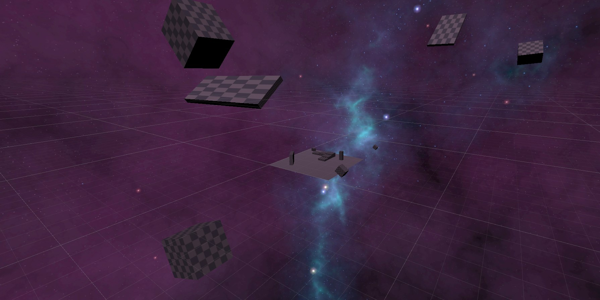

# VR Voice Recognition
  
  ## Table of Contents
  * [Description](#description)
  * [Table](#table)
  * [Sneak-Peek](#sneak-peek)
  * [Contributing](#contributing)
  * [Questions?](#questions)
  
  
  ## Description
  
With virtual reality expanding daily with new innovations and implementations, there is
always room to invent. Movement in VR is important, it is what keeps the user immersed in the
world they are in. With this project, however, with voice recognition driving the player forward,
the aim was to make the world seem as if they are in a simulation. With a galaxy skybox and
floating checkered textured blocks, it takes the realism out so the user can focus on the
implementation. This was done to minimize the nauseousness while in VR, as it was noted
through tests that moving without any thumb stick tracking movement gives off a sickening
feeling and dizziness. But it was also done to express the creativity put into the project and
dedication with the abstract world. The voice commands are simple and allow the user to ask for
specific paths as if it were with a keyboard and mouse. Audio can be listened in by both from the
microphone in the VR headset, or a microphone connected to the computer.

The most difficult part of the project was starting it. To test if the commands were
working, the FPS controller was used for the initial stage. It was planned to have the code inside
of the existing controller script provided by Unity, but it did not suffice. Other methods used,
such as referencing the movement script to another, or using the VR controller’s code for
reference did not work either. It was mentioned in the previous paper that an idea was to rig a
camera to a mesh-less capsule, which at the end is what was done. Doing so allowed the
project’s development to continue at a pace that made sense. Another problem that was blocking
production was to allow the capsule to continuously move forward without a set distance from
when it was called. This was easily fixed by removing the gravity and kinematics from the
capsule so it can move without falling when in contact with a wall. To make it smoother and
more efficient, the Rigidbody SetVelocity was used and greatly increased the quality of the
movement and move forward until another command is called.

When the walking was completed, the rest was simple to implement. Such as the run,
slow, stop, left, right, and so on. For the Home command, for example, resets the world and puts
the capsule controller back to the beginning, as if the user were to manually reset the scene itself.
However, one command had to be changed due to the limitations of the project, which was the
Jump command. Seeing as there is no gravity being used, there is no way for the capsule to
understand when it needs to go back down or how far. Instead of doing a Jump command, it
seemed appropriate, due to the matrix/void like setting, to implement a floating feature. The user
instead can say Go Up and Go Down to traverse up or down the scene. These commands can be
tied in with the walking commands to go forward/back and up/down at the same time. Even with
the Jump command working, in hindsight, it would not work properly as the user would fall over
constantly when trying to jump over the objects in placed. So, this alternative is helpful and 
foolproof in the long run, with the restrictions in place, of course. As for the scene, the floating
debris are animated to simulate the theme. Each have regular colliders, so that the user will stop
in front of the obstacle. With the SetVelocity set in place, the capsule collider does not shake
when stopped by an obstacle.

With the commands done, the focus was shifted to the scene itself and how it can be improved.
Thanks to the contribution from [Makendy Midouin](https://github.com/makendym), the blocks around the scene have been placed with a slow Ping Pong animation calmly animate through its sequences and back. There are invisible walls around the plane as well, to ensure that the player does not fall off. Though, there is no invisible ceiling, as through testing it does not provide a smooth upward and downward movement. Having the ability to float as high as the player wants allows for more possibilities of different angles of the scene to be viewed and provides more integral use for the Home command. All this create a calming experience in VR with voice recognition to apply movement to a VR controller, which was achieved.

  ## Table

This is the table of all the commands that were required for the project and if they have been implemented:

| Commands | Yes/No | Comment |
| :---: | :---: | :---: |
| Go | Yes | Works the same as Walk with a force multiplier of 200. |
| Walk | Yes | Works the same as Go with a force multiplier of 200. |
| Run | Yes | Works the same as Speed Up with a force multiplier of 300. |
| Jump | No | Replaced with Go Up and Go Down due to limitations with jump speed of 2. |
| Stop | Yes | Stop the user no matter where they are or what action they have called. |
| Left | Yes | The command is replaced with Turn Left and only faces the user’s camera middle point, not the walking direction due to limitations. To turn to another direction, the user needs to turn then say the command, such as walk, to continue. Or say the word Stop and then turn. |
| Right | Yes | The command is replaced with Turn Right and only faces the user’s camera middle point, not the walking direction due to limitations. To turn to another direction, the user needs to turn then say the command. |
| Back Up | Yes | Back Up has the same force multiplier as the slow, 100, but negative to move backwards. |
| Speed Up | Yes | Works similar to the Walk command but increases the force multiplier to 300. |
| Slow Down | Yes | Works similar to the Walk command but decreases the force multiplier to 100. Which is related to the Back Up but positive for forward movement. |
| Home | Yes | It will allow the user to reset the scene and return everything to how it is initially. This will reset the user to the starting position in an instant without load time. |
| (Secret Command) | Yes | You will need to look into the code I wrote to figure that one out. Should be a fun surprise. |

  
  ## Sneak-Peek

  

    
  

  
  

    
  

  
  

    
  

  
  ## Contributing
  
  Contributions are always accepted. There is never no room for improvement. 
  
  ---
  
  ## Questions?
  
  For any business related questions, please contact me through my email:
  
  Email: txhakli@gmail.com
